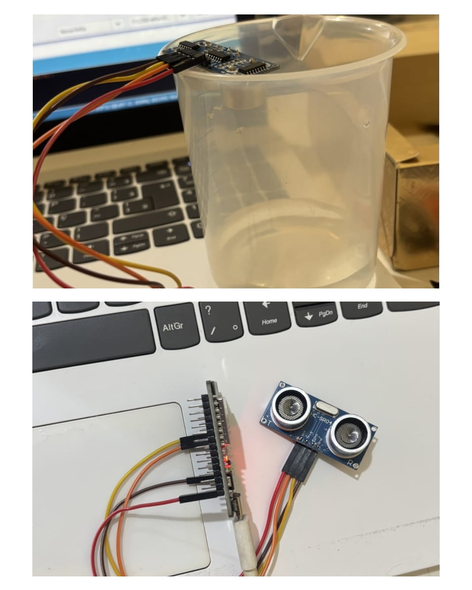

# AquaMind 💧

Sistema inteligente de monitoramento hídrico desenvolvido para auxiliar escolas no controle do nível da água em reservatórios, evitando desperdícios e prevenindo falta de água através da tecnologia.

# 📌 Problema Abordado

Muitas escolas ainda realizam o monitoramento das caixas d’água manualmente, o que pode causar desperdícios, vazamentos e até interrupções das aulas devido à falta de água.

A ausência de acompanhamento em tempo real gera diversos problemas, como:

- Falta de água em banheiros e bebedouros;
- Cancelamento de atividades escolares;
- Desperdício de recursos hídricos;
- Dificuldade no controle do abastecimento;
- Necessidade de verificar o reservatório manualmente.

O AquaMind surge como uma solução acessível e inteligente para melhorar a gestão hídrica no ambiente escolar.

# 💡 Solução Desenvolvida

O AquaMind utiliza tecnologia IoT (Internet das Coisas) para monitorar o nível da água em tempo real.

O sistema funciona através de um sensor ultrassônico instalado na caixa d’água, responsável por medir constantemente a distância até a superfície da água.

Essas informações são enviadas para uma ESP32, que processa os dados e transmite tudo via Wi-Fi para o aplicativo Blynk.

# 🛠 Tecnologias Utilizadas

## Hardware
- ESP32
- USB-C
- Jumper 120U
- HC-SR04

## Software e Plataformas
- Linguagem C++
- Arduino IDE
- Blynk IoT
- Wi-Fi integrado da ESP32

# ⚙️ Instruções de Execução

## 1. Montagem do Circuito

## 2. Configuração do Blynk

1. Crie uma conta no Blynk;
2. Crie um novo projeto;
3. Copie o Auth Token;
4. Configure os widgets de monitoramento.

## 3. Configuração da Arduino IDE

1. Instale a Arduino IDE;
2. Adicione suporte à ESP32;
3. Instale a biblioteca do Blynk;
4. Configure no código:
   - Nome da rede Wi-Fi;
   - Senha;
   - Auth Token.

## 4. Upload do Código

1. Conecte a ESP32 ao computador;
2. Selecione a placa correta na Arduino IDE;
3. Faça o upload do código;
4. Abra o aplicativo Blynk para acompanhar os dados em tempo real.

# 📷 Imagens do Projeto

## Protótipo

## Aplicativo

# 👨‍💻 Equipe

Projeto desenvolvido por alunos do CETI Patronato Irmãos Dantas:

- Davi Meneses Brito
- Gustavo Gomes Fontenele
- João Gabriel da Silva Olivindo Alves
- Pablo Gabriel dos Santos Costa
- Raika de Sousa Ferreira

### Orientadora
- Débora Cristina Santos de Brito

---
